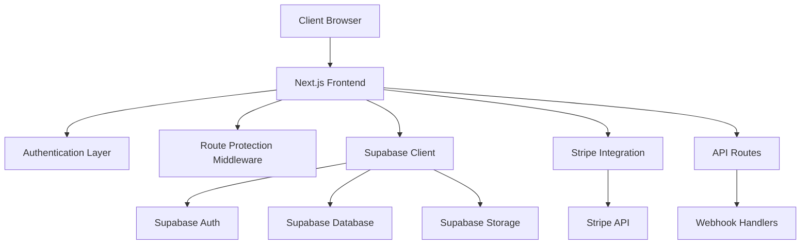
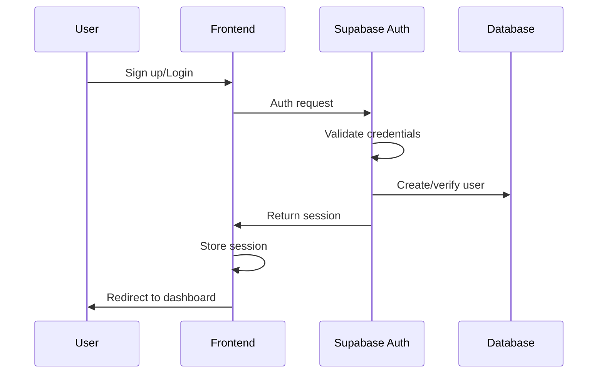
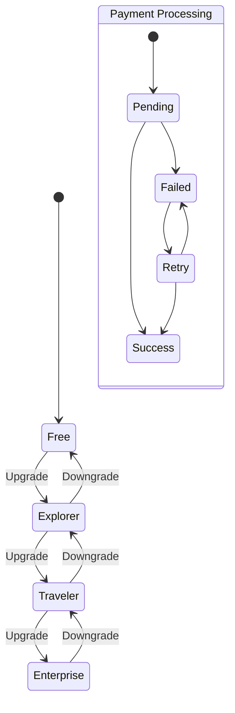

# Design Document

## Overview

This design document outlines the transformation of the existing microtravel experience sharing platform into a comprehensive SaaS application. The transformation includes redesigning the landing page and dashboard with responsive design, implementing robust authentication management, creating a complete SaaS subscription flow with Stripe integration, establishing secure routing throughout the application, and ensuring all pages are complete and functional.

The current platform already has a solid foundation with Next.js 15, Supabase integration, Shadcn UI components, and Tailwind CSS. This design builds upon these existing technologies while adding the necessary SaaS infrastructure.

## Architecture

### High-Level Architecture



### Technology Stack Enhancement

**Current Stack:**
- Frontend: Next.js 15, React 19, TypeScript
- UI: Tailwind CSS, Shadcn UI, Radix UI
- Backend: Supabase (Auth, Database, Storage)
- State Management: React hooks

**Additional Technologies:**
- Payment Processing: Stripe
- Session Management: Next.js middleware
- Email: Supabase Auth (existing)
- Image Optimization: Next.js Image component (existing)

## Components and Interfaces

### 1. Landing Page Redesign

#### Component Structure
```
LandingPage/
├── HeroSection/
│   ├── HeroContent.tsx
│   ├── SearchBar.tsx
│   └── CTAButtons.tsx
├── FeaturesSection/
│   ├── FeatureCard.tsx
│   └── FeatureGrid.tsx
├── PricingSection/
│   ├── PricingCard.tsx
│   ├── PricingToggle.tsx
│   └── PricingComparison.tsx
├── TestimonialsSection/
│   ├── TestimonialCard.tsx
│   └── TestimonialCarousel.tsx
├── FAQSection/
│   ├── FAQItem.tsx
│   └── FAQAccordion.tsx
└── CTASection/
    ├── NewsletterSignup.tsx
    └── GetStartedCTA.tsx
```

#### Responsive Design Strategy
- **Mobile-first approach** with breakpoints at 640px, 768px, 1024px, 1280px
- **Fluid typography** using clamp() for scalable text
- **Flexible grid layouts** that adapt from single column to multi-column
- **Touch-friendly interactions** with minimum 44px touch targets
- **Progressive enhancement** for advanced features

#### Key Features
- **Animated hero section** with gradient backgrounds and floating elements
- **Interactive pricing calculator** showing value proposition
- **Social proof integration** with real user testimonials
- **Performance optimized** with lazy loading and image optimization
- **SEO optimized** with proper meta tags and structured data

### 2. Authentication System

#### Authentication Flow


#### Components
- **AuthProvider**: Context provider for authentication state
- **LoginForm**: Email/password login with validation
- **SignupForm**: Registration with email verification
- **PasswordReset**: Forgot password flow
- **AuthGuard**: Route protection component
- **SessionManager**: Handle session persistence and refresh

#### Security Features
- **Email verification** required for new accounts
- **Password strength validation** with requirements display
- **Rate limiting** on authentication attempts
- **Secure session management** with automatic refresh
- **CSRF protection** using Supabase built-in security

### 3. SaaS Subscription System

#### Subscription Tiers
```typescript
interface SubscriptionTier {
  id: string;
  name: string;
  price: number;
  interval: 'month' | 'year';
  features: string[];
  limits: {
    experiences: number;
    storage: number; // in MB
    exports: number;
  };
  stripeProductId: string;
  stripePriceId: string;
}
```

**Tier Structure:**
1. **Free Tier**: 5 experiences, 50MB storage, basic features
2. **Explorer Tier**: 50 experiences, 500MB storage, advanced features
3. **Traveler Tier**: Unlimited experiences, 5GB storage, premium features
4. **Enterprise Tier**: Custom limits, priority support, API access

#### Stripe Integration Components
- **PaymentForm**: Stripe Elements integration for card collection
- **SubscriptionManager**: Handle plan changes and billing
- **InvoiceHistory**: Display billing history and invoices
- **PaymentMethodManager**: Add/remove payment methods
- **WebhookHandler**: Process Stripe webhooks for subscription events

#### Subscription Flow


### 4. Dashboard Redesign

#### Layout Structure
```
Dashboard/
├── Sidebar/
│   ├── Navigation.tsx
│   ├── UserProfile.tsx
│   └── SubscriptionStatus.tsx
├── Header/
│   ├── Breadcrumbs.tsx
│   ├── SearchBar.tsx
│   └── UserMenu.tsx
├── Content/
│   ├── Overview/
│   ├── MyTrips/
│   ├── Explore/
│   ├── Favorites/
│   ├── Profile/
│   └── Settings/
└── Modals/
    ├── AddExperience/
    ├── EditExperience/
    └── UpgradePrompt/
```

#### Responsive Dashboard Features
- **Collapsible sidebar** for mobile devices
- **Adaptive grid layouts** for different screen sizes
- **Touch-optimized interactions** for mobile users
- **Progressive disclosure** of advanced features
- **Contextual help** and onboarding tooltips

#### Subscription-Aware UI
- **Feature gating** based on subscription tier
- **Usage indicators** showing limits and consumption
- **Upgrade prompts** for premium features
- **Billing notifications** for payment issues

### 5. Route Protection System

#### Middleware Implementation
```typescript
// middleware.ts
export function middleware(request: NextRequest) {
  // Check authentication status
  // Verify subscription level
  // Redirect if unauthorized
  // Allow access if authorized
}
```

#### Protection Levels
1. **Public Routes**: Landing page, pricing, about
2. **Auth Required**: Dashboard, profile, settings
3. **Subscription Required**: Premium features, advanced analytics
4. **Admin Only**: Admin dashboard, user management

#### Route Configuration
```typescript
interface RouteConfig {
  path: string;
  authRequired: boolean;
  subscriptionRequired?: SubscriptionTier;
  adminOnly?: boolean;
  redirectTo?: string;
}
```

## Data Models

### User Profile Enhancement
```sql
-- Extend existing user profile
ALTER TABLE profiles ADD COLUMN subscription_tier VARCHAR(20) DEFAULT 'free';
ALTER TABLE profiles ADD COLUMN subscription_status VARCHAR(20) DEFAULT 'active';
ALTER TABLE profiles ADD COLUMN stripe_customer_id VARCHAR(255);
ALTER TABLE profiles ADD COLUMN subscription_end_date TIMESTAMP;
ALTER TABLE profiles ADD COLUMN storage_used BIGINT DEFAULT 0;
ALTER TABLE profiles ADD COLUMN created_at TIMESTAMP DEFAULT NOW();
ALTER TABLE profiles ADD COLUMN updated_at TIMESTAMP DEFAULT NOW();
```

### Subscription Management
```sql
-- Subscription tracking table
CREATE TABLE subscriptions (
  id UUID PRIMARY KEY DEFAULT gen_random_uuid(),
  user_id UUID REFERENCES auth.users(id) ON DELETE CASCADE,
  stripe_subscription_id VARCHAR(255) UNIQUE,
  stripe_customer_id VARCHAR(255),
  tier VARCHAR(20) NOT NULL,
  status VARCHAR(20) NOT NULL,
  current_period_start TIMESTAMP,
  current_period_end TIMESTAMP,
  cancel_at_period_end BOOLEAN DEFAULT FALSE,
  created_at TIMESTAMP DEFAULT NOW(),
  updated_at TIMESTAMP DEFAULT NOW()
);

-- Payment history table
CREATE TABLE payment_history (
  id UUID PRIMARY KEY DEFAULT gen_random_uuid(),
  user_id UUID REFERENCES auth.users(id) ON DELETE CASCADE,
  stripe_payment_intent_id VARCHAR(255),
  amount INTEGER NOT NULL,
  currency VARCHAR(3) DEFAULT 'usd',
  status VARCHAR(20) NOT NULL,
  description TEXT,
  created_at TIMESTAMP DEFAULT NOW()
);
```

### Usage Tracking
```sql
-- Track feature usage for billing
CREATE TABLE usage_tracking (
  id UUID PRIMARY KEY DEFAULT gen_random_uuid(),
  user_id UUID REFERENCES auth.users(id) ON DELETE CASCADE,
  feature VARCHAR(50) NOT NULL,
  usage_count INTEGER DEFAULT 1,
  date DATE DEFAULT CURRENT_DATE,
  created_at TIMESTAMP DEFAULT NOW()
);
```

## Error Handling

### Error Categories
1. **Authentication Errors**: Invalid credentials, expired sessions
2. **Authorization Errors**: Insufficient permissions, subscription required
3. **Payment Errors**: Card declined, subscription failed
4. **Validation Errors**: Invalid input, missing required fields
5. **System Errors**: Database errors, external service failures

### Error Handling Strategy
```typescript
interface ErrorResponse {
  code: string;
  message: string;
  details?: any;
  userMessage: string;
  action?: 'retry' | 'upgrade' | 'contact_support';
}
```

### User-Friendly Error Messages
- **Clear explanations** of what went wrong
- **Actionable suggestions** for resolution
- **Contextual help** links where appropriate
- **Graceful degradation** when services are unavailable

## Testing Strategy

### Testing Pyramid
1. **Unit Tests**: Individual components and utilities
2. **Integration Tests**: API routes and database operations
3. **E2E Tests**: Complete user workflows
4. **Visual Regression Tests**: UI consistency across devices

### Key Test Scenarios
- **Authentication flows** (signup, login, logout)
- **Subscription management** (upgrade, downgrade, cancel)
- **Payment processing** (successful and failed payments)
- **Route protection** (authorized and unauthorized access)
- **Responsive design** (different screen sizes)
- **Error handling** (network failures, invalid data)

### Testing Tools
- **Jest**: Unit and integration testing
- **React Testing Library**: Component testing
- **Playwright**: End-to-end testing
- **Stripe Test Mode**: Payment testing
- **Supabase Local Development**: Database testing

## Performance Considerations

### Frontend Optimization
- **Code splitting** by route and feature
- **Lazy loading** of non-critical components
- **Image optimization** with Next.js Image component
- **Bundle analysis** and optimization
- **Caching strategies** for static and dynamic content

### Backend Optimization
- **Database indexing** for frequently queried fields
- **Connection pooling** for database connections
- **Caching** of subscription status and user data
- **Webhook processing** optimization
- **Rate limiting** to prevent abuse

### Monitoring and Analytics
- **Performance monitoring** with Core Web Vitals
- **Error tracking** and alerting
- **User analytics** for feature usage
- **Subscription metrics** and churn analysis
- **Payment success rates** and failure analysis

## Security Considerations

### Data Protection
- **Encryption at rest** for sensitive data
- **HTTPS everywhere** with proper SSL configuration
- **Input validation** and sanitization
- **SQL injection prevention** with parameterized queries
- **XSS protection** with proper output encoding

### Authentication Security
- **Strong password requirements** with validation
- **Session security** with proper expiration
- **CSRF protection** using Supabase security features
- **Rate limiting** on authentication endpoints
- **Account lockout** after failed attempts

### Payment Security
- **PCI compliance** through Stripe
- **Secure webhook verification** with signatures
- **Sensitive data handling** following best practices
- **Audit logging** for payment events
- **Fraud detection** integration with Stripe

## Deployment and Infrastructure

### Environment Configuration
- **Development**: Local Supabase, Stripe test mode
- **Staging**: Supabase staging, Stripe test mode
- **Production**: Supabase production, Stripe live mode

### Environment Variables
```bash
# Existing
NEXT_PUBLIC_SUPABASE_URL=
NEXT_PUBLIC_SUPABASE_ANON_KEY=

# New additions
SUPABASE_SERVICE_ROLE_KEY=
STRIPE_PUBLISHABLE_KEY=
STRIPE_SECRET_KEY=
STRIPE_WEBHOOK_SECRET=
NEXT_PUBLIC_APP_URL=
```

### Deployment Strategy
- **Vercel deployment** with automatic deployments
- **Database migrations** through Supabase CLI
- **Environment-specific configurations**
- **Health checks** and monitoring
- **Rollback procedures** for failed deployments